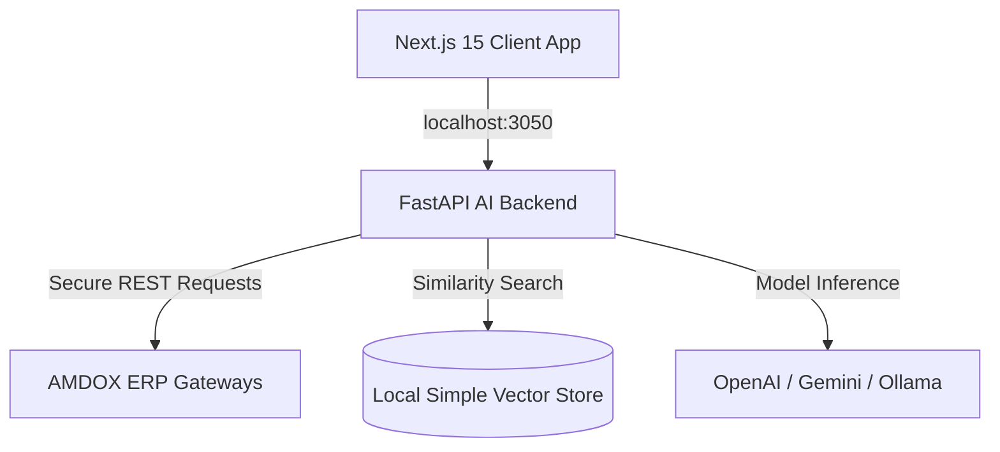

# AMDOX ERP Standalone AI Assistant

A completely separate, standalone Enterprise AI Business Intelligence Assistant that integrates securely with the AMDOX ERP system through REST APIs. 

This application consists of a **Next.js 15** frontend and a **FastAPI** Python backend utilizing a RAG (Retrieval-Augmented Generation) pipeline.

---

## 🏗️ Architecture



### Key Highlights
- **Zero ERP Modifications**: Operates as a completely independent client. All ERP data ingestion is retrieved contextually using authenticated REST endpoints.
- **Multi-Tenant Context Preservation**: Automatically forwards `x-tenant-id` headers, preserving the original ERP's Row-Level Security.
- **RAG Capabilities**: Semantic search capabilities indexed over uploaded policy document sheets.

---

## 🛠️ Technology Stack

### Frontend (`frontend/`)
- **Next.js 15** (Client Portal) & React 19
- **Tailwind CSS v3** & PostCSS
- **Framer Motion** (smooth transitions)
- **Lucide Icons**

### Backend (`backend/`)
- **FastAPI** & Uvicorn (Fast Python REST server)
- **LangChain** (AI Agent Prompt structures)
- **jose** (Session JWT sign & token verification)
- **passlib** (Cryptographic hashing)

---

## 🚀 Running Locally

### Prerequisites
Ensure the primary AMDOX ERP backend is active on port `3000`.

### 1. Launch the Backend
Create a virtual environment, install requirements, and start the FastAPI uvicorn server:
```bash
cd backend
python -m venv venv
venv\Scripts\activate
pip install -r requirements.txt
python app/main.py
```
*The FastAPI backend will start on `http://localhost:8050`.*

### 2. Launch the Frontend
Install Node packages and run the Next.js development server:
```bash
cd ../frontend
npm install
npm run dev
```
*The AI Assistant portal will start on `http://localhost:3050`.*

---

## 💡 Configuring LLM Providers

Click the **Settings Cog** icon in the bottom-left sidebar of the web UI to modify settings:
1. **OpenAI**: Supply `OPENAI_API_KEY` in environment parameters.
2. **Gemini**: Supply `GEMINI_API_KEY` in environment parameters.
3. **Ollama**: Verify that your local Ollama daemon is running on port `11434` with the target model (e.g., `llama2`) downloaded.
4. **Fallback Mode**: If no API key is specified, the server executes a local semantic heuristics engine that simulates analytical reports matching actual records.
